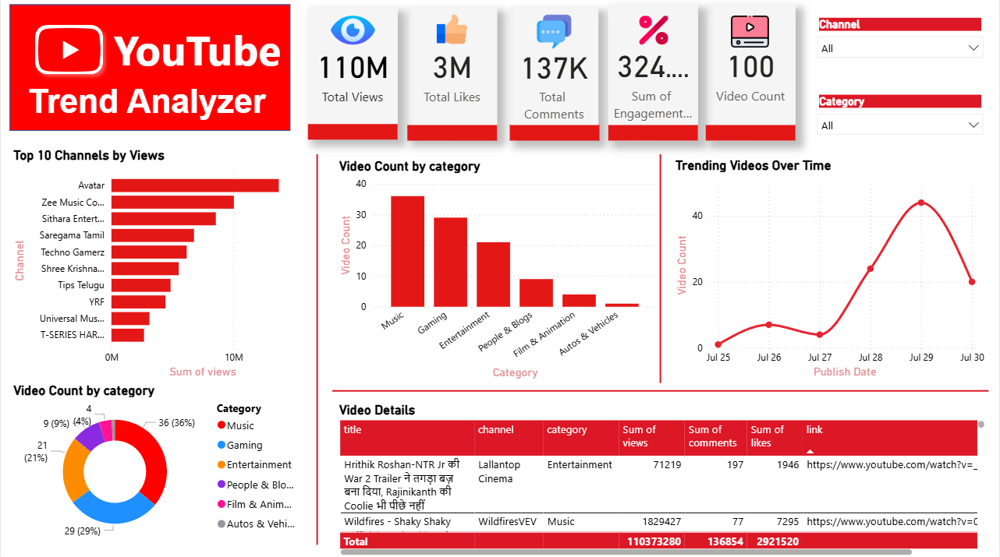

<h1>
 YouTube Trending Video Analyzer
</h1>  
An interactive **YouTube Trending Video Analyzer** built with **Python**, **YouTube Data API**, and **Power BI**.  
This project fetches trending YouTube videos for a specific region, processes key statistics, and visualizes them in a **dynamic dashboard**.

---

## 🚀 Features
- **Fetches trending videos** using the YouTube Data API.
- **Cleans & stores** data (CSV format) with Python & Pandas.
- **Interactive Power BI dashboard** with:
  - **KPIs:** Total Views, Total Likes, Total Comments, Video Count, Engagement Rate.
  - **Top 10 Channels** by Views.
  - **Videos by Category** (Donut & Bar charts).
  - **Trend of Published Videos** (Date line chart).
  - **Detailed Table View** with clickable YouTube links.
- **Custom YouTube Theme** for a modern red & black look.

---

## 🛠️ Tech Stack
- **Python**: Data extraction & processing  
- **Pandas**: Data cleaning & CSV storage  
- **YouTube Data API v3**: Fetching trending video data  
- **Power BI**: Building interactive dashboards  

---

## 📂 Project Structure
youtube_trending_analyzer/

  ├── youtube_api.py # Python script to fetch trending videos

  ├── trending_data.csv # Exported dataset from YouTube API

  ├── youtube_analyzer_dashboard.pbix # Power BI dashboard
  
  ├── data_analysis.py #Insights for streamlit dashboard

  └── README.md # Project documentation

---

## 🔑 Setup Instructions

### **1. Get a YouTube Data API Key**
1. Go to [Google Cloud Console](https://console.cloud.google.com/).  
2. Create a **new project**.  
3. Enable **YouTube Data API v3**.  
4. Go to **APIs & Services → Credentials → Create API Key**.  
5. Copy and use the API key in youtube_api.py.

---

### **2. Install Dependencies**
pip install pandas google-api-python-client

---

### **3. Run the Script**
python youtube_api.py

---

## 📊 Dashboard Preview

  

